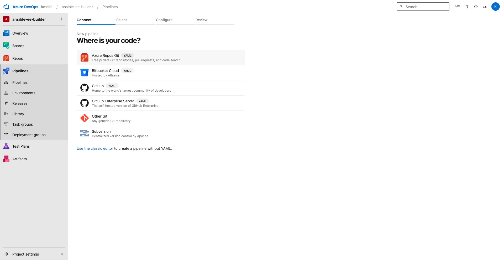

# Azure DevOps Setup

This repository can be used in Azure DevOps with Azure DevOps Pipelines to build the Execution Environments and push them to a Container Registry.

## Prerequisites

- Access to a Container Registry with push/write permissions.  I suggest using [Quay.io](https://quay.io).  Create a few Repositories, add a Robot Account to them with Write permission, and you can use it easily across all these Pipelines.
- Permission to create/import Azure DevOps Projects/Repos.
- Permission to run Azure DevOps Pipelines.

## Setup

1. Log into the Azure Portal: https://portal.azure.com
2. Access Azure DevOps: https://dev.azure.com
3. [Optional] Create a new ADO Organization
4. [Optional] Create a new **Project** in an Organization you have access/permission to

5. Navigate to the **Repos** section of the ADO Project, click the **Import** button to Import a Repository

6. Import a Git type repository, you can use this upstream repo as the **Clone URL Source**: `https://github.com/kenmoini/ansible-ee-builder`

7. Once imported, you should see the **Files** section of the ADO Repo populated.

8. Navigate to the **Pipelines** section, click the kebab menu (3 vertical dots) next to the Create Pipeline button, select the **Import a pipeline** option

9. When importing a pipeline, in the **Connect** section choose **Azure Repos Git** for the source

10. **Select** the repository that was just imported into ADO Repos

11. **Configure your pipeline** with an **Existing Azure Pipelines YAML file**

12. In the pane that opens to the right, select the path to the `/execution-environments/default-ee/azure-pipelines.yml` file

13. **Review the Pipeline YAML**, replace line 15 where it defines the `REGISTRY_PATH` parameter - use your Quay username or whatever path to the target Repository in your Container Registry that you set up.  Click **Save**.

14. Once the Pipeline is imported, make sure to Rename it

15. Repeat steps 8-14 for the remaining Azure Pipelines for the other Execution Environments if you'd like, eg:
    1.  `/execution-environments/k8s-ee/azure-pipelines.yml`
    2.  `/execution-environments/nutanix-ee/azure-pipelines.yml`
    3.  `/execution-environments/windows-ee/azure-pipelines.yml`
    4.  `/execution-environments/ztp-ee/azure-pipelines.yml`
16. In the ADO Pipelines section, navigate to **Library** and create a new **Variable Group**

17. **Name** the Variable Group `RegistrySecrets` - if this name is modified the base pipeline template also needs to be modified to match.  Add the `REGISTRY_USERNAME` and `REGISTRY_PASSWORD` variables and make sure to click the Lock button to the right of their rows to **make them Secrets**.

18. Click **Save** to set this Variable Group

19. In the same RegistrySecrets Variable Group, click the **Pipeline permissions** button

20. **Add the Pipelines** to allow them to use the Variable Group

21. **Repeat** this for the remaining Pipelines

22. In the ADO Pipelines page, you can now expand the kebab menu and select **Run pipeline**

23. These ADO Pipelines will also be triggered whenever their Execution Environment files have changes pushed to them - as well as scheduled to run weekly at midnight on Sunday.